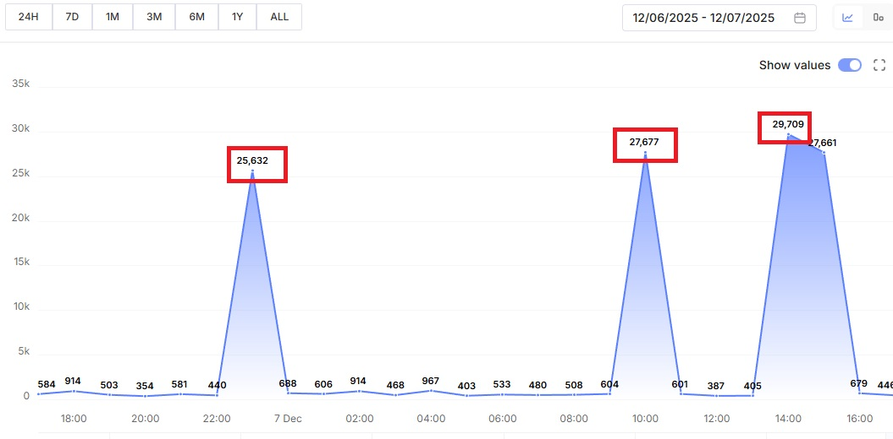
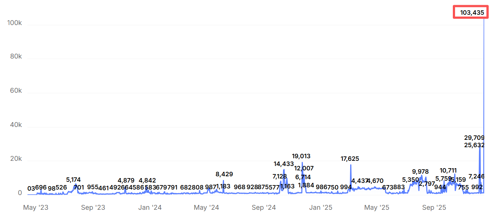
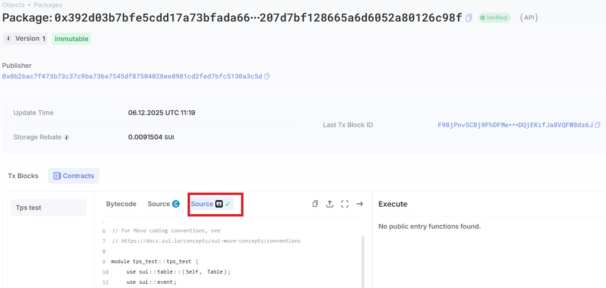

# Sui TPS Benchmark Tool

This is a high-performance stress testing project based on Sui Move smart contracts and TypeScript scripts. Utilizing Sui blockchain's **Parallel Execution Model** and **Programmable Transaction Blocks (PTB)** technology, this tool aims to benchmark the network's TPS (Transactions Per Second) and CPS (Commands Per Second) under extreme loads.

## 📊 Benchmark Results

This tool has been tested on the Sui Mainnet and demonstrated extremely high throughput capabilities:

### 1. Single-Instance Peak
Running this tool on a single machine, the peak throughput reached **29,709 CPS**.


### 2. Multi-Instance Concurrent Peak
Running three test instances simultaneously, the Sui network sustained an astonishing throughput of **103,435 CPS**.


> **Note**: The data above is captured from the SuiScan block explorer.

---

## 📁 Project Structure & Modules

The project consists of two core Move contract packages and a set of TypeScript client scripts.

### 1. Smart Contracts (Move)
*   **`tps_test/` (Core Benchmark Contract)**
    *   **Counter Object**: A simple shared object used to handle high-frequency write operations.
    *   **create_counter**: Batches the creation of counters to establish parallel state anchors.
    *   **operate**: The counter increment operation (the main payload for stress testing).
    *   **GlobalState**: A global state table that maintains the index of counters.
    *   *Status*: Verified on Mainnet (Verified Source Code: https://suiscan.xyz/mainnet/object/0x392d03b7bfe5cdd17a73bfada66eccd59d207d7bf128665a6d6052a80126c98f ).
      

*   **`minimal_test/` (Deployment Stress Contract)**
    *   **minimal_module**: A minimalist empty module.
    *   **Purpose**: Specifically designed to test the network's throughput for **Publish** transactions by repeatedly deploying this contract to apply "deployment pressure" on the network.

### 2. Client Scripts (`scripts/`)
*   **Core Benchmark Flow**:
    *   `deploy_tps_test.ts`: Deploys the `tps_test` contract.
    *   `create_new_counters.ts`: Calls the contract to batch create `Counter` objects on-chain.
    *   `tps_run.ts`: **The Core Script**. Automatically splits Gas, establishes parallel channels, and sends massive amounts of transactions using PTBs (1 transaction contains 1023 operations).
    *   `fetch_onchain_counters.ts`: Helper script to fetch created Counter IDs from the chain.

*   **Deployment Benchmark Flow**:
    *   `deploy_minimal_test.ts`: Loops compilation and deployment of the `minimal_test` contract to test package publishing performance.

*   **Configuration & Infrastructure**:
    *   `.prepare_gas.ts`: Smart Gas management. Splits large amounts of SUI into multiple small Gas Coins to support multi-threaded parallel transaction submission without blocking.
    *   `config.json` / `.config.ts`: Project configuration files.

---

## 🚀 Quick Start

### 1. Environment Preparation

Ensure you have **npm and npx version 11.6.1** and **Node.js version v24.10.0**.

Install dependencies:
```bash
cd scripts
npm init -y
npm install @mysten/sui dotenv bip39 typescript ts-node @types/node @types/bip39
```

### 2. Configure Private Key

Create a `.env` file in the `scripts/` directory:
```env
SUI_PRIVATE_KEY=suiprivkey1xxxxxxxxxxxxxxxxxxxxxxxxxxxxxxxxxxxxxx
```
> ⚠️ **Warning**: It is recommended to have at least 5 SUI available for Gas splitting and high-frequency transaction fees.

---

## 🧪 Scenario 1: TPS/CPS Transaction Stress Test

This is the primary purpose of this project: testing the network's ability to handle concurrent transactions.

### 1. Deploy Contract (Optional)
If you are using existing contracts (see `config.json`), skip this step. If you need to deploy new contracts:
```bash
npx tsx deploy_tps_test.ts
```
Record the output `Package ID`, `GlobalState ID`, and `UpgradeCap ID`, then update them in `scripts/config.json`.

### 2. Create Counter Objects (Optional)
To support concurrency, multiple shared objects must be created for different "threads" to write to.
```bash
npx tsx create_new_counters.ts
```
*   The script will batch create Counters based on the `globalStateId` in `config.json`.
*   Upon success, the console will print the list of Counter IDs.

### 3. Fetch/Verify Counters (Optional)
If you forgot the Counter IDs or want to sync existing counters from the chain:
```bash
npx tsx fetch_onchain_counters.ts
```
Update the fetched ID list into the `counters` field in `config.json`.

### 4. Run Benchmark (Run)
```bash
npx tsx tps_run.ts
```
**Execution Logic**:
1.  **Gas Preparation**: Automatically checks and splits Gas Coins (Split Coins) to ensure each concurrent channel has an independent Gas object.
2.  **Channel Establishment**: Maps Gas objects to Counter objects one-to-one.
3.  **Local Calculation**: Caches Gas object Version/Digest to build transactions locally, significantly reducing RPC interaction latency.
4.  **Parallel Sending**: All channels simultaneously send PTB transactions containing 1023 commands each.

---

## 📦 Scenario 2: Contract Deployment Throughput Test

Tests the stability of the network when receiving a large volume of `Publish` transactions in a short period.

### Run Deployment Benchmark
```bash
npx tsx deploy_minimal_test.ts
```
*   The script reads the contract from the `minimal_test` directory.
*   Default loop executes 1000 deployment operations (can be modified via `REPEAT_COUNT` in the code).
*   Real-time statistics on deployment success rate and time consumption.

---

## ⚙️ Configuration Details (`config.json`)

The configuration file `scripts/config.json` controls the behavior of the entire benchmarking tool. Below are the detailed meanings of parameters and their underlying logic:

### 1. Basic Control Parameters

| Parameter | Type | Example | Description |
| :--- | :--- | :--- | :--- |
| `network` | string | `"testnet"` | **Target Network**.<br>Values: `"mainnet"` or `"testnet"`.<br>The script automatically reads the corresponding sub-configurations in `object`, `fee`, and `counters` based on this field. |
| `targetCount` | number | `50` | **Concurrent Channels (Core)**.<br>1. **Gas Prep Phase** (`prepare_gas.ts`): Ensures your account has at least this many independent Gas Coins.<br>2. **Run Phase** (`tps_run.ts`): Decides how many parallel Promise tasks to launch.<br>⚠️ *Suggested: 50-100 per machine. Too high may cause Node.js OOM or local CPU bottlenecks.* |
| `iters` | number | `5` | **Iterations per Channel**.<br>The number of times each channel loops to send transactions. Total Transactions = `targetCount` × `iters`.<br>Total Operations (CPS Base) ≈ Total Tx × 1023. |
| `iterInterval` | number | `2` | **Send Interval (ms)**.<br>The sleep time after each transaction sent in the `tps_run.ts` loop.<br>Set to `0` for full speed (Fire-and-Forget mode) to maximize pressure. |
| `startTime` | string | `"2025-..."` | **Scheduled Start Time** (Format: `YYYY-MM-DD HH:mm:ss`).<br>`tps_run.ts` checks this time on startup:<br>- If time hasn't arrived, it counts down.<br>- **Usage**: For distributed testing across multiple machines, coordinating all machines to fire instantly at the same second. |

### 2. Resource Indexing & RPC

| Parameter | Type | Description |
| :--- | :--- | :--- |
| `startCounterIndex` | number | **Counter List Offset**.<br>**Usage**: When multiple machines share the same `config.json`, prevents them from operating on the same Counter object causing conflicts.<br>- Machine A: `0` (Uses array index 0~49)<br>- Machine B: `50` (Uses array index 50~99) |
| `rpcs` | object | **RPC Node Pool**.<br>Contains URL arrays for `mainnet` and `testnet`. It is recommended to add multiple paid/private nodes to avoid public node rate limits. |
| `rpcIndex` | number | **Current RPC Index**.<br>Specifies which node in the `rpcs` array the script connects to. Useful for quick switching if a node goes down. |

### 3. Object & Contract Config (`object`)

Defines specific on-chain addresses for Move contracts, separated into `mainnet` and `testnet` configurations.

*   **`module`**: Move contract module name (e.g., `tps_test`).
*   **`opCreateCounter`**: Function name for creating counters.
*   **`opOperate`**: Core benchmark function name (executes increment).
*   **`package`**: The Package ID after deployment.
*   **`globalState`**: Global state shared object ID (for creating new Counters).
*   **`upgradeCap`**: Contract upgrade capability object ID (for deployer's reference).

### 4. Gas Strategy Config (`fee`)

Directly affects `prepare_gas.ts` behavior for automatic Gas Coin splitting and merging.

```json
"fee": {
  "mainnet": {
    "minSuiThreshold": 0.03, 
    "splitAmountSui": 0.04
  }
}
```

*   **`minSuiThreshold` (SUI)**: **Minimum Available Threshold**.
    *   The script checks coins under the current account; only coins with balance > this value are used as Gas objects.
    *   *Logic*: If a Gas Coin balance is too low, it may run out during the benchmark, causing failure. Thus, small fragments are filtered out.
*   **`splitAmountSui` (SUI)**: **Split Target Amount**.
    *   When available Gas objects are fewer than `targetCount`, the script splits large SUI into multiple small Coins of this amount.
    *   *Suggestion*: Should be slightly larger than `minSuiThreshold`.

### 5. Target Object List (`counters`)

```json
"counters": {
  "mainnet": [ "0x...", "0x..." ],
  "testnet": [ "0x...", "0x..." ]
}
```
*   **Source**: Generated by `create_new_counters.ts` or fetched by `fetch_onchain_counters.ts`.
*   **Usage**: During the benchmark, `tps_run.ts` reads Object IDs from here sequentially and pairs them with Gas Coins. This ensures each concurrent thread operates on an independent Counter object, avoiding **Write Contention**, which is key to high TPS.

---

### 📝 Configuration Examples & Tuning Tips

**Scenario A: Single Machine Extreme Performance**
```json
{
  "targetCount": 100,      // Open 100 concurrent channels
  "iterInterval": 0,       // No wait, fire at full speed
  "startCounterIndex": 0,  
  "rpcIndex": 1            // Recommended to use paid private RPC nodes
}
```

**Scenario B: Distributed Benchmark (3 Machines)**
*   **Machine 1**: `targetCount: 50`, `startCounterIndex: 0`
*   **Machine 2**: `targetCount: 50`, `startCounterIndex: 50`
*   **Machine 3**: `targetCount: 50`, `startCounterIndex: 100`
*   **All Machines**: Set the same `startTime` (e.g., 2 minutes in the future). Run the script, and they will countdown and fire simultaneously.

---

## 🌟 Core Design Principles

1.  **PTB Aggregation**: Leveraging Sui's PTB feature, a single transaction carries ~1023 state changes. This is the key to achieving 100k+ CPS.
2.  **Resource Isolation**: `prepare_gas.ts` ensures N concurrent tasks have N independent Gas Coins and operate on N different Counter objects respectively, completely eliminating on-chain **Resource Contention**.
3.  **Client-side Prediction**: `tps_run.ts` implements local Gas version deduction. When submitting continuous transactions, it does not wait for the RPC to return the latest Object Version but updates the state locally and initiates the next transaction, minimizing client-side latency.