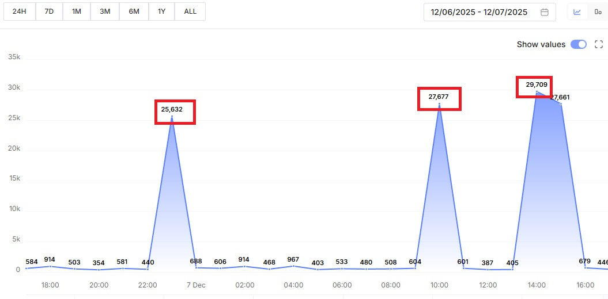

# Sui TPS Benchmark Tool

This is a performance testing project based on Sui Move smart contracts and TypeScript scripts. It aims to conduct high-concurrency TPS (Transactions Per Second) stress testing on the Sui blockchain network (Testnet/Mainnet) using parallel execution and Programmable Transaction Block (PTB) technology.

The image below is from **SuiScan**, a well-known SUI explorer, showing the results of several stress tests conducted on SUI Mainnet using this tool on a single machine. As shown, it can easily reach a peak of nearly **30k TPS**.



## 📁 Project Structure & Modules

The project is divided into two main parts: On-chain Contracts (`tps-test`) and Client Scripts (`scripts`).

### 1. Smart Contract (Move)
Located in the root directory, the core logic is in `sources/tps_test.move`:
*   **Counter Object**: A simple shared object containing a `value` field.
*   **create_counter**: Creates new counter objects.
*   **operate**: Increments the counter (this is the main payload function for the stress test).
*   **GlobalState**: Maintains the global state of counter indices.

### 2. Client Scripts (TypeScript)
Located in the `scripts/` directory, responsible for orchestrating the test flow:
*   **`deploy.ts`**: Automatically compiles the Move contract and publishes it to the specified network, returning the Package ID and Upgrade Cap.
*   **`create_counters.ts`**: Batch creates on-chain `Counter` objects to serve as targets for subsequent stress testing.
*   **`prepare_gas.ts`**: **Key Module**. Manages Gas objects. It splits large amounts of SUI into multiple smaller Gas Coins to support multi-threaded parallel transaction submission, avoiding queueing caused by contention on a single Gas object.
*   **`tps_run.ts`**: **Core Benchmark Script**.
    *   Automatically fetches/prepares Gas Coins.
    *   Randomly assigns Counter objects.
    *   Sends transactions in parallel, with each transaction utilizing PTB (Programmable Transaction Blocks) to pack over a thousand operations.
    *   Statistics and output of TPS data and fund consumption.
*   **`config.ts` / `config.json`**: Project configuration files managing network environments, Object IDs, fee thresholds, etc.

---

## 🚀 Quick Start

### 1. Prerequisites

Ensure you have installed the following tools:
*   [Node.js](https://nodejs.org/) (v18+ recommended)
*   [Sui CLI](https://docs.sui.io/guides/developer/getting-started/sui-install) (Used for compiling Move)

Initialize project dependencies:
```bash
cd scripts
npm init -y
npm install
```

### 2. Configure Private Key

Create a `.env` file in the `scripts/` directory and fill in your SUI private key (starting with `suiprivkey`):

```env
SUI_PRIVATE_KEY=suiprivkey1xxxxxxxxxxxxxxxxxxxxxxxxxxxxxxxxxxxxxx
```
> ⚠️ **Note**: Please ensure this account has sufficient SUI tokens on the test network (At least 5-10 SUI is recommended for splitting Gas and paying for high-frequency transaction fees).

### 3. Deploy Contract
The project has already deployed ready-to-use contracts on **Mainnet** and **Testnet**. You can configure the following parameters directly into `config.json` without redeploying.


**Deployed Contract Parameters (Reference for config.json):**

| Network | Package ID | GlobalState ID | UpgradeCap ID |
| :--- | :--- | :--- | :--- |
| **Testnet** | `0x7395d305e3530c68adaf0d1b5e932e267048e7daf3f701a0eb2e24125039ee09` | `0x3fea3215978af68d44f53a56ee286c1f0e05042e9daf7f3fb6971b13166c2fbc` | `0x135b7c03d935535f21d97468195d719e3c706b203948e47ede0651573d51aa42` |
| **Mainnet** | `0x392d03b7bfe5cdd17a73bfada66eccd59d207d7bf128665a6d6052a80126c98f` | `0x05a0da84f34e9425a09e6dbf833e41f6b69933966fa3d72c6ed64e7ebd2eb488` | `0x0b2bac7f473b73c37c9ba736e7545df87504028ee0981cd2fed7bfc5130a3c5d` |

If you need to deploy your own new contract:

```bash
npx tsx deploy.ts
```
After successful deployment, the console will output the `Package ID`, `GlobalState`, etc. Be sure to update these IDs in `scripts/config.json` under the corresponding network configuration (e.g., the `testnet` field).

### 4. Create Counters
To support concurrent testing, there must be enough Counter objects on-chain. `config.json` is pre-populated with a large number of available counter objects.

**Existing Counter Objects:**

<details>
<summary>🔻 Click to expand Mainnet Counter List (Partial)</summary>

```json
[
  "0x1e8bd7c5f95cb3c2ad448b3cf256eab5bb0c407d9d524e3cdd48c0ef2ab1cac5",
  "0x21474a3cb9d43049c66623628cd9708bf20eb3313c17c8e08e9f308dc504e5b4",
  "0x224caeb34c7f904062da64933cfbee73f8daf338873f343bcc3caabb7663dd5d",
  "...",
  "0xf631f1f7b685b9a9d7345a85119ae908870ac9fd42943bd6a7d7e598bde51ffc"
]
```
*(See `counters.mainnet` in scripts/config.json for the full list)*
</details>

<details>
<summary>🔻 Click to expand Testnet Counter List (Partial)</summary>

```json
[
  "0x38e6474e963e3ffb9fb7ebb2b54c27c75e92669491f5c7eab311b313a76ead66",
  "0xc833525099fd595ecaecc2f0f1f290d1dffc44bbdb0fd01c764c897d69d000f3",
  "0xfea424be2324d75c4853cf1aa4c4274178d83805c14d521072c5a125ae154aed",
  "...",
  "0xff486ebd2dc4878e60cdf68aad7a3bec17b4e3839849a7620aa7f37da5757385"
]
```
*(See `counters.testnet` in scripts/config.json for the full list)*
</details>

If you deployed a new contract or want to increase the concurrency count, run the following command to create new counters:

```bash
npx tsx create_counters.ts
```
The script will batch create objects. Once completed, update the **Counter ID List** output in the console to the `counters` array in `scripts/config.json`.

### 5. Configure Benchmark Parameters

Open `scripts/config.json` and adjust the parameters according to your needs:

*   `network`: The running network (`testnet` or `mainnet`).
*   `targetCount`: **Concurrency Channels**. Determines the number of threads sending transactions in parallel (Recommended 10-100).
*   `iters`: The number of times each channel sends transactions cyclically.
*   `iterInterval`: The wait time in milliseconds between each cycle (0 means full speed).
*   `fee`: Amount settings related to Gas splitting.

### 6. Run TPS Test

Once everything is ready, start the benchmark:

```bash
npx tsx tps_run.ts
```

**Script Execution Flow:**
1.  **Gas Preparation**: Checks if the current account has a sufficient number (`targetCount`) of Gas objects. If insufficient, it automatically performs splitting (Split Coins). If there are too many fragments, it automatically merges them (Merge Coins).
2.  **Resource Allocation**: Maps Gas objects to Counter objects 1-to-1 to establish parallel channels.
3.  **Concurrent Execution**: All channels start working simultaneously. Each transaction contains approximately 1023 `operate` calls (leveraging PTB features).
4.  **Local Cache Optimization**: The script caches the Version and Digest of Gas objects. It constructs transactions using a local loop, drastically reducing network query latency.
5.  **Report Output**: After the test finishes, it outputs total duration, success rate, estimated TPS, and SUI consumption.

---

## 🌟 Advantages & Design Principles

1.  **Max Throughput**:
    *   Leverages the **Sui PTB (Programmable Transaction Block)** feature to pack the maximum number of instructions allowed by Move (approx. 1023 commands) into a single transaction. This means 1 signature on-chain = 1023 state changes.

2.  **True Parallelism**:
    *   Sui's parallel model is object-based. This tool uses `prepare_gas.ts` to ensure each concurrent task owns an independent Gas Coin.
    *   By pairing different Gas Coins with different Counter objects, it achieves completely non-interfering parallel channels, fully squeezing network performance.

3.  **Optimized Client**:
    *   The script implements **Local Gas Prediction** logic. When sending transactions continuously, it does not need to query the RPC for the latest Gas object Version every time. Instead, it directly uses the result of the previous transaction to update the state locally, achieving extremely low transaction submission latency.

4.  **Automation**:
    *   No manual Coin fragment management required. The script has built-in smart Gas splitting and merging logic to keep the account clean and ready for use.