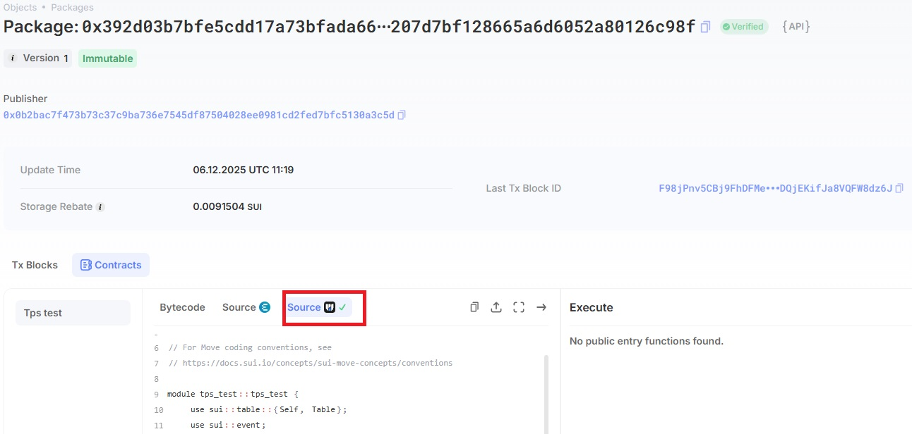

# Sui TPS 性能测试工具 (Sui TPS Benchmark)

这是一个基于 Sui Move 智能合约和 TypeScript 脚本的性能测试项目。该工具旨在通过并行执行和可编程交易块（PTB）技术，对 Sui 区块链网络（Testnet/Mainnet）进行高并发的 TPS（每秒交易数）压力测试。

如下图片来自SuiScan这一知名的SUI浏览器网站，展示的是在单机上使用本压测工具对SUI Mainnet上的几次压测的结果， 可以看到可以轻松达到近30k TPS的峰值。


## 📁 项目结构与模块说明

项目主要分为两大部分：链上合约 (`tps-test`) 和 客户端脚本 (`scripts`)。

### 1. 智能合约 (Move)
位于根目录下，核心逻辑在 `sources/tps_test.move`：
*   **Counter 对象**: 一个简单的共享对象，包含一个 `value` 字段。
*   **create_counter**: 创建新的计数器对象。
*   **operate**: 对计数器进行加一操作（这是压测的主要负载函数）。
*   **GlobalState**: 维护计数器索引的全局状态。

### 2. 客户端脚本 (TypeScript)
位于 `scripts/` 目录下，负责编排测试流程：
*   **`deploy.ts`**: 自动编译 Move 合约并将其发布到指定网络，返回 Package ID 和 Upgrade Cap。
*   **`create_counters.ts`**: 批量创建链上 `Counter` 对象，作为后续压测的目标资源。
*   **`prepare_gas.ts`**: **关键模块**。负责管理 Gas 对象。它会将大额 SUI 拆分成多个小的 Gas Coin，以便支持多“线程”并行发送交易，避免从同一个 Gas 对象扣费导致的排队等待。
*   **`tps_run.ts`**: **核心压测脚本**。
    *   自动获取/准备 Gas Coin。
    *   随机分配 Counter 对象。
    *   并行发送交易，每笔交易利用 PTB (Programmable Transaction Blocks) 打包上千次操作。
    *   统计并输出 TPS 数据和资金消耗。
*   **`config.ts` / `config.json`**: 项目的配置文件，管理网络环境、对象ID、费用阈值等。

---

## 🚀 快速开始

### 1. 环境准备

确保你已安装以下工具：
*   [Node.js](https://nodejs.org/) (建议 v18+)
*   [Sui CLI](https://docs.sui.io/guides/developer/getting-started/sui-install) (用于编译 Move)

初始化项目依赖：
```bash
cd scripts
npm init -y
npm install
```

### 2. 配置私钥

在 `scripts/` 目录下创建一个 `.env` 文件，填入你的 SUI 私钥（以 `suiprivkey` 开头）：

```env
SUI_PRIVATE_KEY=suiprivkey1xxxxxxxxxxxxxxxxxxxxxxxxxxxxxxxxxxxxxx
```
> ⚠️ **注意**: 请确保该账户在测试网有足够的 SUI 代币（建议至少 5-10 SUI 用于拆分 Gas 和支付高频交易费）。

### 3. 部署合约 (Deploy)
项目已在 **Mainnet** 和 **Testnet** 部署了现成的合约，你可以直接使用以下参数配置到 `config.json` 中，无需重新部署。


**已部署合约参数 (参考 config.json):**


| 网络环境 | Package ID | GlobalState ID | UpgradeCap ID |
| :--- | :--- | :--- | :--- |
| **Testnet** | `0x7395d305e3530c68adaf0d1b5e932e267048e7daf3f701a0eb2e24125039ee09` | `0x3fea3215978af68d44f53a56ee286c1f0e05042e9daf7f3fb6971b13166c2fbc` | `0x135b7c03d935535f21d97468195d719e3c706b203948e47ede0651573d51aa42` |
| **Mainnet** | `0x392d03b7bfe5cdd17a73bfada66eccd59d207d7bf128665a6d6052a80126c98f` | `0x05a0da84f34e9425a09e6dbf833e41f6b69933966fa3d72c6ed64e7ebd2eb488` | `0x0b2bac7f473b73c37c9ba736e7545df87504028ee0981cd2fed7bfc5130a3c5d` |

如果你需要部署自己的新合约：

```bash
npx tsx deploy.ts
```
部署成功后，控制台会输出 `Package ID`、`GlobalState` 等信息。请务必将这些 ID 更新到 `scripts/config.json` 对应的网络配置中（如 `testnet` 字段下）。

### 4. 创建计数器对象 (Create Counters)
为了支持并发测试，链上需要有足够多的 Counter 对象。`config.json` 中已经预置了大量可用的计数器对象。

**已存在的计数器对象 (Counter Objects):**

<details>
<summary>🔻 点击展开查看 Mainnet 计数器列表 (部分)</summary>

```json
[
  "0x1e8bd7c5f95cb3c2ad448b3cf256eab5bb0c407d9d524e3cdd48c0ef2ab1cac5",
  "0x21474a3cb9d43049c66623628cd9708bf20eb3313c17c8e08e9f308dc504e5b4",
  "0x224caeb34c7f904062da64933cfbee73f8daf338873f343bcc3caabb7663dd5d",
  "...",
  "0xf631f1f7b685b9a9d7345a85119ae908870ac9fd42943bd6a7d7e598bde51ffc"
]
```
*(完整列表请查看 scripts/config.json 的 `counters.mainnet` 字段)*
</details>

<details>
<summary>🔻 点击展开查看 Testnet 计数器列表 (部分)</summary>

```json
[
  "0x38e6474e963e3ffb9fb7ebb2b54c27c75e92669491f5c7eab311b313a76ead66",
  "0xc833525099fd595ecaecc2f0f1f290d1dffc44bbdb0fd01c764c897d69d000f3",
  "0xfea424be2324d75c4853cf1aa4c4274178d83805c14d521072c5a125ae154aed",
  "...",
  "0xff486ebd2dc4878e60cdf68aad7a3bec17b4e3839849a7620aa7f37da5757385"
]
```
*(完整列表请查看 scripts/config.json 的 `counters.testnet` 字段)*
</details>

如果你使用了新部署的合约，或者想增加并发数量，请运行以下命令创建新的计数器：

```bash
npx tsx create_counters.ts
```
脚本会批量创建对象。创建完成后，将控制台输出的 **Counter ID 列表** 更新到 `scripts/config.json` 的 `counters` 数组中。

### 5. 配置压测参数 (Config)

打开 `scripts/config.json`，根据需求调整参数：

*   `network`: 运行网络 (`testnet` 或 `mainnet`)。
*   `targetCount`: **并发通道数**。决定了并行发送交易的线程数（建议 10-100）。
*   `iters`: 每个通道循环发送交易的次数。
*   `iterInterval`: 每次循环之间的等待毫秒数（0 表示全速运行）。
*   `fee`: Gas 拆分相关的金额设置。

### 6. 运行 TPS 测试 (Run)

一切准备就绪，启动压测：

```bash
npx tsx tps_run.ts
```

**脚本执行流程：**
1.  **Gas 准备**: 检查当前账户是否有足够数量（`targetCount`）的 Gas 对象。如果不足，会自动进行拆分（Split Coins）。如果碎片过多，会自动合并（Merge Coins）。
2.  **资源分配**: 将 Gas 对象与 Counter 对象一一对应，建立并行通道。
3.  **并发执行**: 所有通道同时开始工作。每笔交易包含约 1023 次 `operate` 调用（利用 PTB 特性）。
4.  **本地缓存优化**: 脚本会缓存 Gas 对象的 Version 和 Digest，实现本地闭环构建交易，极大降低网络查询延迟。
5.  **报告输出**: 测试结束后，输出总耗时、成功率、预估 TPS 以及 SUI 消耗量。

---

## 🌟 项目优势与设计原理

1.  **最大化 TPS (Max Throughput)**:
    *   利用 **Sui PTB (可编程交易块)** 特性，在单笔交易中塞入 Move 允许的最大指令数（约 1023 个命令）。这意味着 1 次签名上链 = 1023 次链上状态变更。

2.  **真正的并行 (True Parallelism)**:
    *   Sui 的并行模型基于对象。本工具通过 `prepare_gas.ts` 确保每个并发任务拥有独立的 Gas Coin。
    *   通过将不同的 Gas Coin 搭配不同的 Counter 对象，实现了完全互不干扰的并行通道，充分压榨网络性能。

3.  **极速客户端 (Optimized Client)**:
    *   脚本实现了**本地 Gas 预测**逻辑。在连续发送交易时，不需要每次都去 RPC 查询 Gas 对象的最新版本（Version），而是直接利用上一笔交易的返回结果在本地更新状态，实现了极低的交易提交延迟。

4.  **自动化管理 (Automation)**:
    *   无需手动管理 Coin碎片。脚本内置了智能的 Gas 拆分与合并逻辑，保持账户整洁且随时可用。

